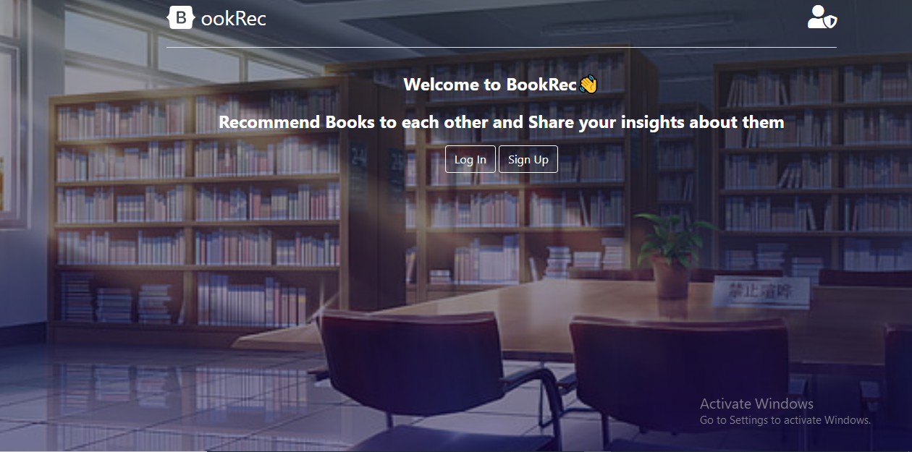

# BookRec

> BookRec is special app to be in touch with people to suggest and advise books that you find useful and meaningful to each other. You can follow most loked recommendators.
<table>
<tr><td>  </td></tr>
<tr><td>  </td></tr>
<tr><td>  </td></tr>
   
</table>
## Business requirements:

## Built With

- <code></code> Ruby Language  
-  <code></code> Ruby on Rails  
- &nbsp; Git 
- &nbsp; GitHub 
- &nbsp; VScode

## Getting Started

### Prerequisites
- Node
- Rails
- Yarn
- Git
- Node

#### Clone this repository on to your local PC

- Click on the `Code` green button
- By the right end of the read-only input containing the repository link click the clipboard icon to copy the link
- In your local PC, open your terminal in the folder you would like to clone the repository into
- Clone the repository with the command: `git clone (copied link)`; like so: `git clone https://github.com/AbdumurodovaZulfizar/ror-social-scaffold`
- After the clone, type in the command `cd ror-socail-scaffold` to access the directory on the terminal
- Then run `bundle update` to update gem file
- And type `bundle install` to load all gems in this folder.
- After run `rails db:migrate` for migration.
- Type `rails s` on the terminal, and type `localhost:3000` on your browser.
- And then you can Sign In.

## Prerequisites
- Ruby: 2.7.0
- Rails: 5.2.3 
- Postgres: >=9.5

## To run test
- cd into ror-social-scaffold
- type `bundle exec rspec`

## Live Demo
[Mini Insta](https://arcane-island-34002.herokuapp.com/)

## Authors

👩🏻‍💼 **Zulfizar Abdumurodova**

- GitHub: [Abdumurodova Zulfizar](https://github.com/AbdumurodovaZulfizar)
- Twitter: [Abdumurodova Zulfizar](https://twitter.com/Zulfiza70357085)
- LinkedIn: [Abdumurodova Zulfizar](https://www.linkedin.com/in/zulfizar-abdumurodova-a61527206/)

## 🤝 Contributing

Contributions, issues, and feature requests are welcome!

## Show your support

Give a ⭐️ if you like this project!

## Acknowledgments

- [Microverse](https://www.microverse.org/) for international opportunities.
- Special thanks to all code reviewers.
- AppAcademy and FreeCodeCamp for their open source
- Thanks for project design to [Gregoire Vella on Behance](https://www.behance.net/gregoirevella)

## 📝 License

Copyright 2021 Zulfizar Abdumurodova
- [MIT](https://github.com/AbdumurodovaZulfizar/ror-social-scaffold/blob/milestone_six/LICENSE) for this project.
